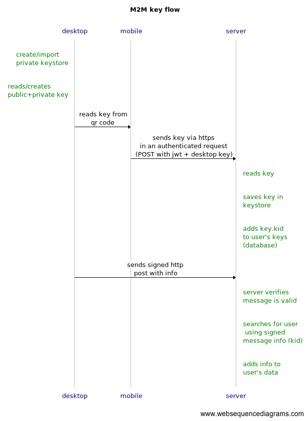
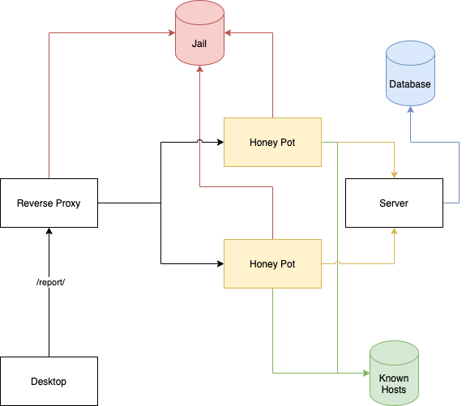

# Remote devices monitor system (WIP)

The goal is to build a system that can register new devices into a server via QR code and monitor those devices via web/mobile app. 

## How it works ( M2M auth flow )

If anyone reading this has a better solution, feel free to open an issue to discuss it.
----

- desktop-app starts by generating a private/public key 
- desktop app generates a QR code with both system info and the public key and shows it to the user
- mobile-app reads the QR code and sends it to the server
- server registers new device and adds the public key to the known keys
- desktop-app sends system info every few seconds 
- server only accepts known public keys
- mobile app reads data from server via graphql

--------

Possible architecture to prevent spam on the open endpoints:

---------

## Technologies
(subject to change)

- Device app
    - electronjs with React
    - systeminformation
    - qrcode
    - node-jose

- Server
    - docker
    - express.js
    - node-jose
    - graphql

- Web/mobile app
    - React 
    - React native

